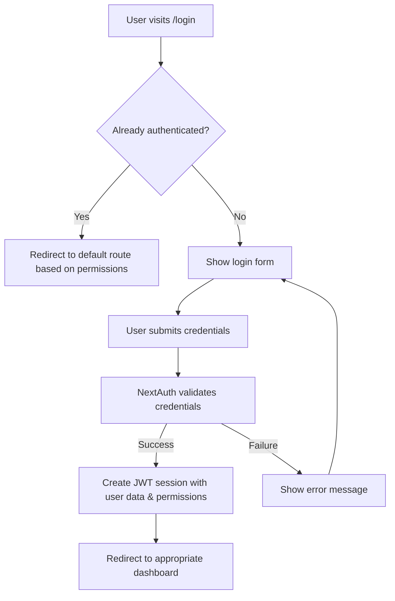
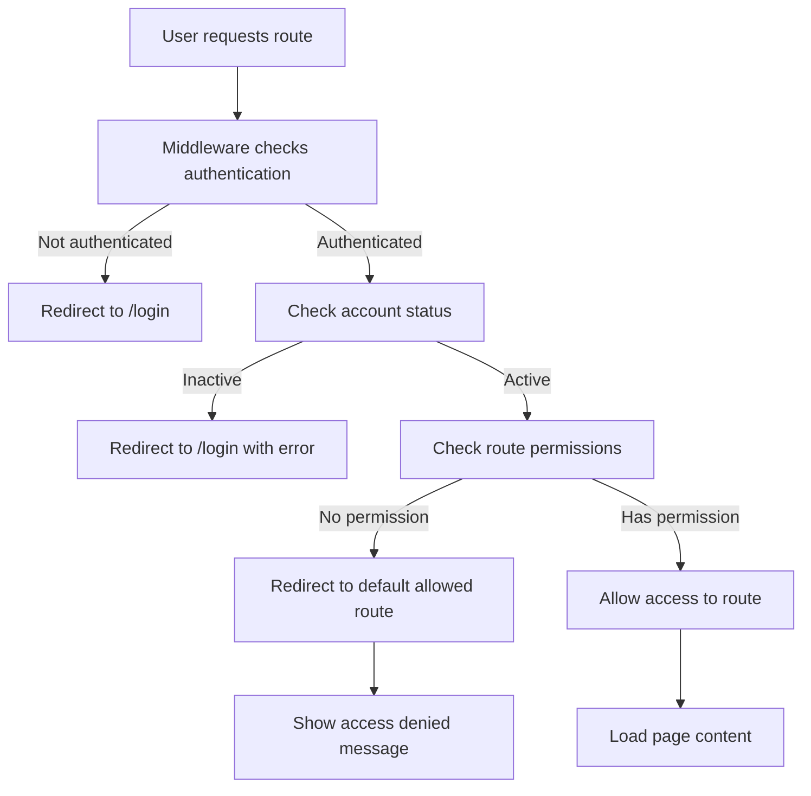

# CQAMS Authentication & Authorization Flow

## Overview

CQAMS implements a comprehensive authentication and authorization system using NextAuth.js with custom permission-based access control. The system provides multiple layers of security and user experience enhancements.

## Architecture Components

### 1. **SessionProvider** (Root Level)
- **Location**: `src/app/layout.js`
- **Purpose**: Provides NextAuth session context to entire application
- **Scope**: Wraps all pages and components

```javascript
<SessionProvider>
  <ThemeProvider>
    <RoleProvider>
      {children}
    </RoleProvider>
  </ThemeProvider>
</SessionProvider>
```

### 2. **Middleware** (Route Protection)
- **Location**: `middleware.js`
- **Purpose**: Server-side route protection before pages load
- **Features**:
  - Blocks unauthorized route access
  - Dynamic permission checking
  - Automatic redirects based on user permissions
  - Performance optimization (prevents unnecessary page loads)

### 3. **Dashboard Layout** (Authentication Guard)
- **Location**: `src/app/(dashboard)/layout.jsx`
- **Purpose**: Client-side authentication verification for dashboard routes
- **Features**:
  - Session status checking
  - Loading states
  - Automatic login redirect

### 4. **Component-Level Protection**
- **Components**: `PermissionWrapper`, `AuthGuard`
- **Purpose**: Granular UI control based on permissions
- **Features**:
  - Conditional rendering
  - Fallback content
  - Custom permission checks

## Authentication Flow

### 1. **Login Process**



#### Login Page Features:
- **Auto-redirect**: If already logged in, redirects to appropriate dashboard
- **Permission-based routing**: Uses `getDefaultRoute()` to determine where to send users
- **Demo accounts**: Quick login buttons for testing different roles
- **Error handling**: Displays specific error messages for different failure scenarios
- **Loading states**: Shows loading indicators during authentication

### 2. **Route Protection Flow**



### 3. **Session Management**

#### Session Structure:
```javascript
{
  user: {
    id: "user_id",
    name: "John Doe",
    email: "john@example.com",
    employeeId: "EMP001",
    role: {
      id: "role_id",
      name: "HR Manager",
      permissions: [
        {
          module: "users",
          action: "view",
          resource: "employees"
        },
        // ... more permissions
      ]
    },
    status: "Active",
    image: "profile_image_url"
  }
}
```

## Authorization Levels

### 1. **Route-Level Authorization** (Middleware)
```javascript
// Automatic based on ROUTE_PERMISSIONS mapping
const ROUTE_PERMISSIONS = {
  '/employees': { module: 'users', action: 'view', resource: 'employees' },
  '/admin': { module: 'system', action: 'all', resource: '*' }
};
```

### 2. **Page-Level Authorization** (Layout Guards)
```javascript
// Dashboard layout automatically checks authentication
export default function DashboardLayout({ children }) {
  const { data: session, status } = useSession();
  
  if (status === 'unauthenticated') {
    router.replace('/login');
  }
  
  return <DashboardContent>{children}</DashboardContent>;
}
```

### 3. **Component-Level Authorization**
```javascript
// Using PermissionWrapper
<PermissionWrapper action="create" resource="employees" module="users">
  <AddEmployeeButton />
</PermissionWrapper>

// Using AuthGuard
<AuthGuard requiredRoles={['Super Admin', 'HR Manager']}>
  <AdminPanel />
</AuthGuard>
```

### 4. **Hook-Based Authorization**
```javascript
// Using usePermissions hook
const { canCreate, canUpdate, canDelete } = usePermissions('employees', 'users');

return (
  <div>
    {canCreate && <AddButton />}
    {canUpdate && <EditButton />}
    {canDelete && <DeleteButton />}
  </div>
);
```

## User Experience Features

### 1. **Smart Redirects**
- **After login**: Redirects to user's default route based on highest permission level
- **Access denied**: Redirects to user's allowed route with error message
- **Logout**: Redirects to login page

### 2. **Loading States**
- **Initial load**: Shows spinner while checking authentication
- **Route changes**: Shows loading during permission verification
- **Component rendering**: Graceful loading for permission-protected components

### 3. **Error Handling**
- **Login errors**: Specific messages for different failure types
- **Access denied**: Clear messages about why access was denied
- **Account issues**: Helpful messages for inactive accounts

### 4. **Navigation Filtering**
- **Dynamic menu**: Only shows accessible routes in navigation
- **Permission-aware**: Menu items appear/disappear based on user permissions
- **Role-based**: Different navigation for different user roles

## Security Features

### 1. **Defense in Depth**
1. **Middleware**: First line of defense (server-side)
2. **Layout Guards**: Second line of defense (client-side)
3. **Component Guards**: Third line of defense (UI-level)
4. **API Protection**: Fourth line of defense (data-level)

### 2. **Session Security**
- **JWT tokens**: Secure session management
- **Permission caching**: Permissions stored in JWT for performance
- **Automatic expiry**: Sessions expire after 24 hours
- **Status checking**: Account status verified on each request

### 3. **Permission Validation**
- **Dynamic checking**: Permissions checked against current user state
- **Granular control**: Module/Action/Resource level permissions
- **Wildcard support**: Flexible permission patterns
- **Custom logic**: Support for complex permission scenarios

## Implementation Examples

### 1. **Protecting a Page**
```javascript
// Option 1: Using AuthGuard component
export default function AdminPage() {
  return (
    <AuthGuard requiredRoles={['Super Admin']}>
      <AdminContent />
    </AuthGuard>
  );
}

// Option 2: Using HOC
export default withAuthGuard({
  requiredPermission: { module: 'system', action: 'all', resource: '*' }
})(AdminPage);

// Option 3: Using hook
export default function AdminPage() {
  const { isAuthenticated, isAuthorized } = useAuthGuard({
    requiredRoles: ['Super Admin']
  });
  
  if (!isAuthenticated) return <LoginPrompt />;
  if (!isAuthorized) return <AccessDenied />;
  
  return <AdminContent />;
}
```

### 2. **Protecting UI Elements**
```javascript
export default function EmployeeList() {
  const { canCreate, canUpdate, canDelete } = usePermissions('employees', 'users');
  
  return (
    <div>
      <div className="header">
        <h1>Employees</h1>
        {canCreate && <AddEmployeeButton />}
      </div>
      
      <Table>
        {employees.map(employee => (
          <TableRow key={employee.id}>
            <TableCell>{employee.name}</TableCell>
            <TableCell>
              {canUpdate && <EditButton />}
              {canDelete && <DeleteButton />}
            </TableCell>
          </TableRow>
        ))}
      </Table>
    </div>
  );
}
```

### 3. **Custom Permission Logic**
```javascript
<PermissionWrapper
  action="view"
  resource="employees"
  module="users"
  customCheck={(permissions, user) => {
    // Managers can only see their department
    if (user.role?.name === 'Manager') {
      return user.department === employee.department;
    }
    return true;
  }}
>
  <EmployeeDetails />
</PermissionWrapper>
```

## Logout Implementation

### 1. **Logout Button**
```javascript
// src/components/auth/LogoutButton.jsx
const handleLogout = async () => {
  await signOut({
    callbackUrl: '/login',
    redirect: true
  });
};
```

### 2. **UserNav Integration**
```javascript
// src/components/user-nav.jsx
<DropdownMenuItem onClick={handleLogout} className="text-red-600">
  <LogOut className="mr-2 h-4 w-4" />
  <span>Log out</span>
</DropdownMenuItem>
```

## Best Practices

### 1. **Security**
- Always validate permissions on server-side (API routes)
- Use middleware for route protection
- Implement component-level checks for UX only
- Never trust client-side permission checks for security

### 2. **Performance**
- Cache permissions in JWT tokens
- Use permission hooks with default resources
- Implement loading states for better UX
- Filter navigation items based on permissions

### 3. **User Experience**
- Provide clear error messages
- Implement smart redirects
- Show loading states during authentication
- Use fallback content for denied access

### 4. **Maintainability**
- Centralize permission logic
- Use reusable components and hooks
- Document permission requirements
- Keep permission structure consistent

## Troubleshooting

### Common Issues:

1. **Infinite redirects**: Check middleware configuration and route permissions
2. **Session not updating**: Ensure SessionProvider wraps the app
3. **Permissions not working**: Verify JWT token contains role and permissions
4. **Loading states**: Check useSession status handling

### Debug Tools:

1. **Permission Debug Info**: Available in development mode
2. **Session inspection**: Use browser dev tools to check session data
3. **Middleware logs**: Check server logs for middleware execution
4. **Network tab**: Monitor authentication requests and responses

This comprehensive authentication system ensures secure, user-friendly access control throughout the CQAMS application. 